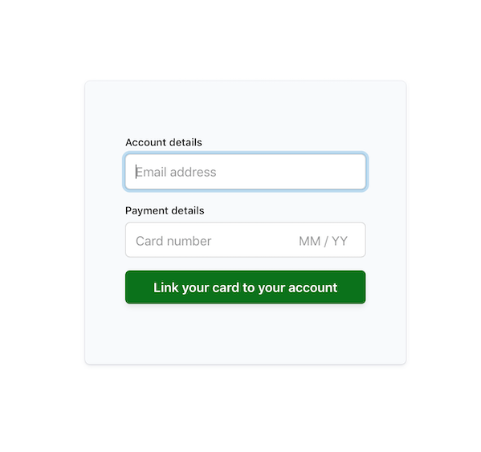

# Saving cards without payment sample

This sample shows how to build a form to save a credit card without taking a payment using the [Setup Intents API](https://stripe.com/docs/api/setup_intents). This sample
is a fully working version of [this guide](https://stripe.com/docs/payments/save-and-reuse).

**Demo**

See a hosted version of the [sample](https://q0sh7.sse.codesandbox.io/) in test mode or [fork on codesandbox.io](https://codesandbox.io/s/stripe-saving-card-without-payment-q0sh7)

The hosted demo is running in test mode -- use `4242424242424242` as a test card number with any CVC + future expiration date.

Use the `4000000000003220` test card number to trigger a 3D Secure challenge flow.

Read more about test cards on Stripe at https://stripe.com/docs/testing.



## How to run locally

This sample includes 5 server implementations in Node, Ruby, Python, Java, and PHP.

Follow the steps below to run locally.

**1. Clone and configure the sample**

The Stripe CLI is the fastest way to clone and configure a sample to run locally.

**Using the Stripe CLI**

If you haven't already installed the CLI, follow the [installation steps](https://github.com/stripe/stripe-cli#installation) in the project README. The CLI is useful for cloning samples and locally testing webhooks and Stripe integrations.

In your terminal shell, run the Stripe CLI command to clone the sample:

```
stripe samples create saving-card-without-payment
```

The CLI will walk you through picking your integration type, server and client languages, and configuring your .env config file with your Stripe API keys.

**Installing and cloning manually**

If you do not want to use the Stripe CLI, you can manually clone and configure the sample yourself:

```
git clone https://github.com/stripe-samples/saving-card-without-payment
```

Copy the .env.example file into a file named .env in the folder of the server you want to use. For example:

```
cp .env.example server/node/.env
```

You will need a Stripe account in order to run the demo. Once you set up your account, go to the Stripe [developer dashboard](https://stripe.com/docs/development/quickstart#api-keys) to find your API keys.

```
STRIPE_PUBLISHABLE_KEY=<replace-with-your-publishable-key>
STRIPE_SECRET_KEY=<replace-with-your-secret-key>
```

`STATIC_DIR` tells the server where to the client files are located and does not need to be modified unless you move the server files.

Note: If you install the sample with the Stripe CLI using `stripe samples
create saving-card-without-payment` then the path to the directory with static
files will be `../client` if you install the sample by git cloning the entire
repository this will be set to `../../client`.

**2. Follow the server instructions on how to run:**

Pick the server language you want and follow the instructions in the server folder README on how to run.

```
cd server/node # there's a README in this folder with instructions
npm install
npm start
```

**3. [Optional] Run a webhook locally:**

If you want to test with a local webhook on your machine, you can use the Stripe CLI to easily spin one up.

First [install the CLI](https://stripe.com/docs/stripe-cli) and [link your Stripe account](https://stripe.com/docs/stripe-cli#link-account).

```
stripe listen --forward-to localhost:4242/webhook
```

The CLI will print a webhook secret key to the console. Set `STRIPE_WEBHOOK_SECRET` to this value in your .env file.

You should see events logged in the console where the CLI is running.

When you are ready to create a live webhook endpoint, follow our guide in the docs on [configuring a webhook endpoint in the dashboard](https://stripe.com/docs/webhooks/setup#configure-webhook-settings).

### Supported languages

- [JavaScript (Node)](/server/node)
- [Python (Flask)](/server/python)
- [Ruby (Sinatra)](/server/ruby)
- [PHP (Slim)](/server/php)
- [Java (Spark)](/server/java)

## FAQ

Q: Why did you pick these frameworks?

A: We chose the most minimal framework to convey the key Stripe calls and concepts you need to understand. These demos are meant as an educational tool that helps you roadmap how to integrate Stripe within your own system independent of the framework.

## Get support
If you found a bug or want to suggest a new [feature/use case/sample], please [file an issue](../../issues).

If you have questions, comments, or need help with code, we're here to help:
- on [IRC via freenode](https://webchat.freenode.net/?channel=#stripe)
- on Twitter at [@StripeDev](https://twitter.com/StripeDev)
- on Stack Overflow at the [stripe-payments](https://stackoverflow.com/tags/stripe-payments/info) tag
- by [email](mailto:support+github@stripe.com)

Sign up to [stay updated with developer news](https://go.stripe.global/dev-digest).

## Author(s)

[@ctrudeau-stripe](https://twitter.com/trudeaucj)
