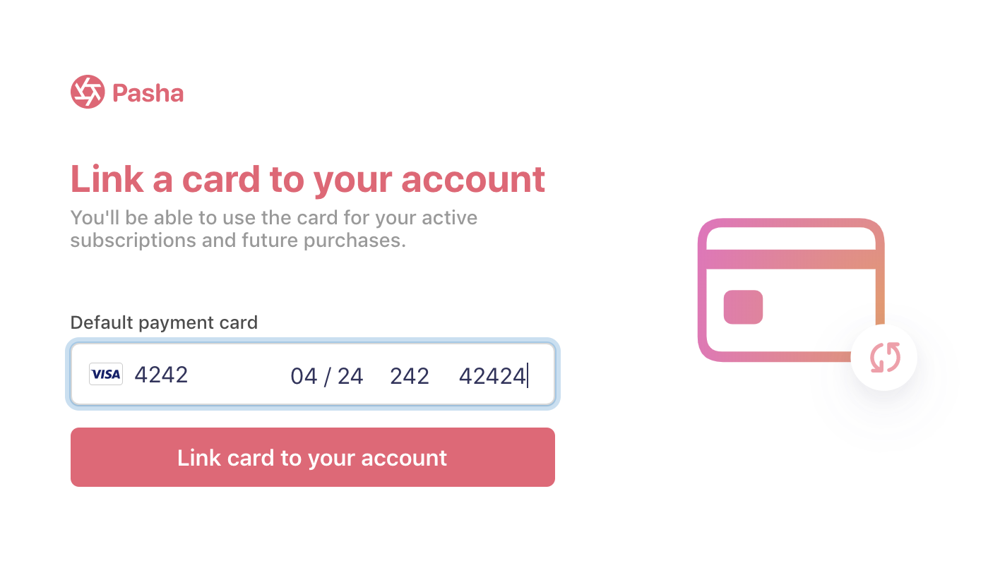

# Saving cards without payment sample

This sample shows how to build a form to save a credit card without taking a payment using the [Setup Intents API](https://stripe.com/docs/api/setup_intents). This sample
is a fully working version of [this guide](https://stripe.com/docs/payments/cards/saving-cards#saving-card-without-payment).

See a hosted version of the demo in test mode or fork on codesandbox.io



## How to run locally

Each sample implementation includes 5 servers in Node, Ruby, Python, Java, and PHP in the [/server](/server) directory. We included several RESTful server that each implement the same endpoints and logic.
Pick the language you are most comfortable in and follow the instructions in the directory on how to run.

If you want to run the sample locally, copy the .env.example file to your own .env file in this directory and follow the instructions in the specific server implementation you want to run.

```
cp .env.example .env
```

You will need a Stripe account with its own set of [API keys](https://stripe.com/docs/development#api-keys).

### Supported languages

- [JavaScript (Node)](/server/node)
- [Python (Flask)](/server/python)
- [Ruby (Sinatra)](/server/ruby)
- [PHP (Slim)](/server/php)
- [Java (Spark)](/server/java)

## FAQ

Q: Why did you pick these frameworks?

A: We chose the most minimal framework to convey the key Stripe calls and concepts you need to understand. These demos are meant as an educational tool that helps you roadmap how to integrate Stripe within your own system independent of the framework.

Q: Can you show me how to build X?

A: We are always looking for new recipe ideas, please email tbd@stripe.com with your suggestion!

## Author(s)

[@ctrudeau-stripe](https://twitter.com/trudeaucj)
